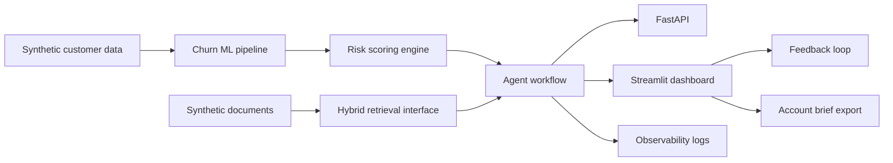

# Revenue Risk Intelligence Agent

**One-line summary:** An AI/data science decision-support product that predicts customer churn risk, estimates revenue at risk, retrieves account evidence, recommends retention actions, and presents everything in a business dashboard.

**Live demo:** Pending manual Streamlit Community Cloud deployment. The repository is ready to deploy using `app/streamlit_app.py`.

All data in this repository is synthetic demo data.

This project demonstrates how machine learning, RAG, agentic workflows, evaluation, observability, feedback loops, and business dashboards can be combined into a practical customer-success decision-support system.

## Business Problem

Customer-success teams often need to prioritise renewals using scattered signals: usage, support tickets, contract value, payment delay, NPS, call notes, onboarding history, and retention playbooks. A churn score alone is not enough. Teams also need evidence, explanation, next action, and a shareable account brief.

## Why This Is Not Just A Chatbot

This project combines structured ML predictions with retrieval-grounded evidence and deterministic business logic. The agent does not simply answer open-ended prompts; it scores accounts, cites synthetic evidence, recommends actions, drafts a customer-success email, logs observability events, collects feedback, and supports what-if simulation.

## Key Features

- Synthetic customer-success data and synthetic RAG document corpus
- scikit-learn churn model with saved artifact and model metrics
- Revenue-at-risk scoring and top risk drivers
- Hybrid retrieval interface with TF-IDF fallback and semantic extension point
- Optional OpenAI-compatible LLM provider with deterministic mock fallback
- Agent workflow with grounded answer, cited evidence, caveats, recommended actions, and email draft
- Groundedness and hallucination-risk heuristic evaluation
- Human feedback logging
- Account brief Markdown export
- What-if simulator for intervention planning
- FastAPI backend
- Streamlit executive dashboard
- Docker, Docker Compose, Makefile, GitHub Actions CI

## Architecture



## Screenshots


The committed screenshot shows the full executive dashboard view. Additional screenshots can be captured after deployment from the Overview, Account Deep Dive, Ask The Agent, What-If Simulator, Evaluation, and Observability tabs.

## Tech Stack

Python, pandas, NumPy, scikit-learn, FastAPI, Streamlit, Pydantic, pytest, Docker, Docker Compose, GitHub Actions, and local TF-IDF retrieval.

## Setup

```bash
python3 -m venv .venv
source .venv/bin/activate
pip install -r requirements.txt
```

## Makefile Commands

```bash
make setup      # create virtual environment and install dependencies
make data       # regenerate synthetic customers and documents
make train      # train churn model
make score      # score customers
make retriever  # build local retrieval artifact
make evaluate   # run RAG evaluation
make test       # run tests
make api        # start FastAPI
make app        # start Streamlit
make docker     # run API and dashboard with Docker Compose
```

## Run Locally

API:

```bash
make api
```

Open:

- `http://localhost:8000/health`
- `http://localhost:8000/docs`

Dashboard:

```bash
make app
```

Open:

- `http://localhost:8501`

## Docker

```bash
docker compose up --build
```

- FastAPI: `http://localhost:8000`
- Streamlit: `http://localhost:8501`

## Deployment

Recommended dashboard deployment: Streamlit Community Cloud.

- Main file: `app/streamlit_app.py`
- Python runtime: `runtime.txt`
- Secrets required: none for mock/local demo mode
- Optional secrets: `OPENAI_API_KEY`, `OPENAI_BASE_URL`, `OPENAI_MODEL`, `LLM_PROVIDER=openai`
- Current public deployment status: ready, but not deployed from Codex because Streamlit Community Cloud requires manual browser login and app creation.

Detailed instructions are in [docs/deployment.md](docs/deployment.md).

## Model Results

Current synthetic-data model metrics:

- ROC-AUC: 0.7758
- Precision: 0.4848
- Recall: 0.5161
- F1: 0.5000
- Test rows: 150
- Positive churn rate: 20.5%

These metrics are for synthetic demo data and should not be interpreted as production churn performance.

## RAG Evaluation

The RAG evaluation dataset lives at `data/evaluation/rag_eval_questions.csv`.

The evaluation checks:

- precision@k
- recall@k
- expected risk-theme match
- expected document-type match
- retrieval latency
- groundedness heuristic
- evidence coverage

Latest committed summary is stored in `data/processed/rag_evaluation_summary.csv`.

## Observability And Feedback

Agent runs are logged to `data/processed/agent_runs.jsonl` with run ID, timestamp, customer ID, question, retrieved document IDs, risk band, latency, response length, and provider mode.

Human feedback is logged separately with run ID, customer ID, rating, feedback reason, question, risk band, and timestamp.

## Limitations

- All customer data and documents are synthetic.
- TF-IDF retrieval is transparent and local but less semantically rich than embeddings.
- The default LLM provider is deterministic mock mode.
- The churn labels are generated from synthetic assumptions.
- Production use would require real CRM/product data, authentication, privacy review, monitoring, and human governance.

## Future Work

- Add optional embedding retrieval provider.
- Add MLflow experiment tracking.
- Add labelled human relevance judgments.
- Add richer time-series product usage.
- Add Power BI export tables.
- Deploy the Streamlit demo publicly.

## Portfolio Summary

Revenue Risk Intelligence Agent demonstrates applied data science across the full product lifecycle: synthetic data design, supervised ML, explainability, RAG, agent workflow design, API development, dashboarding, evaluation, observability, feedback loops, testing, CI, Docker packaging, and deployment readiness.

## Author

Janak Raj Joshi

Applied Data Scientist

- Portfolio: https://janakjocee.vercel.app/
- GitHub: https://github.com/janakjocee
- LinkedIn: https://www.linkedin.com/in/janakjocee
