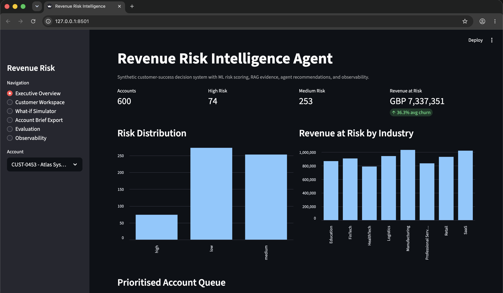

# Revenue Risk Intelligence Agent

A portfolio-grade AI/data science project for customer-success teams. It combines churn prediction, revenue-at-risk scoring, retrieval-augmented evidence, agentic recommendations, observability, and a Streamlit dashboard.

All data in this repository is synthetic demo data.

## Why This Matters

Customer-success teams often have account data in one place, support notes in another, and renewal strategy in someone else's head. This project turns those signals into a decision-support workflow:

- Which customers are most likely to churn?
- How much recurring revenue is at risk?
- What evidence supports the risk assessment?
- What action should the team take next?
- Can the system explain itself clearly enough for business users?

## Key Features

- Synthetic customer-success data generator with churn labels
- Synthetic RAG document corpus with customer metadata
- scikit-learn churn model with saved model artifact
- Risk scoring engine with revenue-at-risk estimates and top drivers
- Local TF-IDF retriever that works without an API key
- Hybrid retrieval interface with lexical fallback and optional semantic extension point
- Agent workflow for explanations, cited evidence, recommendations, and email drafts
- Optional OpenAI-compatible LLM provider with deterministic mock fallback
- Human feedback logging for agent runs
- Account brief Markdown export for customer-success handoff
- What-if simulator for account intervention planning
- FastAPI backend for scoring, Q&A, observability, and evaluation
- Streamlit dashboard for customer-success workflows
- JSONL observability logging
- Retrieval evaluation script
- pytest suite, Docker, Docker Compose, and GitHub Actions CI

## Architecture

```text
Synthetic customer data         Synthetic notes and playbooks
          |                                  |
          v                                  v
  scikit-learn churn model            TF-IDF retriever
          |                                  |
          v                                  v
       Risk scoring engine -----> Agent workflow
                                      |
                                      v
                         FastAPI + Streamlit dashboard
                                      |
                                      v
                              Observability logs
```

## Tech Stack

Python, pandas, NumPy, scikit-learn, FastAPI, Streamlit, Pydantic, pytest, Docker, Docker Compose, and GitHub Actions.

Optional LLM mode is configured through `.env` values such as `OPENAI_API_KEY`, `OPENAI_BASE_URL`, `OPENAI_MODEL`, and `LLM_PROVIDER`. Without a key, the project automatically uses the deterministic mock provider.

## Setup

```bash
python3 -m venv .venv
source .venv/bin/activate
pip install -r requirements.txt
```

## Developer Commands

```bash
make setup      # create virtual environment and install dependencies
make data       # regenerate synthetic customers and documents
make train      # train churn model
make score      # score customers
make retriever  # build local retrieval artifact
make evaluate   # run RAG evaluation
make test       # run tests
make api        # start FastAPI
make app        # start Streamlit
make docker     # run API and dashboard with Docker Compose
```

Regenerate all local demo artifacts:

```bash
python3 scripts/generate_customer_data.py --rows 600 --seed 42
python3 scripts/generate_documents.py --docs-per-customer 4 --seed 42
python3 scripts/train_churn_model.py
python3 scripts/score_customers.py
python3 scripts/build_retriever.py
python3 scripts/evaluate_rag.py
```

## Run the API

```bash
uvicorn src.api.main:app --reload
```

Open:

- Health: `http://localhost:8000/health`
- Docs: `http://localhost:8000/docs`

Example request:

```bash
curl -X POST http://localhost:8000/ask \
  -H "Content-Type: application/json" \
  -d '{"customer_id":"CUST-0001","question":"Why is this customer at risk?","include_email":true}'
```

## Run the Dashboard

```bash
streamlit run app/streamlit_app.py
```

The dashboard includes:

- Overview metrics
- Customer risk table
- Customer detail workspace
- AI agent question panel
- Retrieved evidence panel
- Recommended actions
- Email draft
- Human feedback capture
- What-if simulator
- Account brief export
- Evaluation and observability views

## Screenshots

Executive overview:



## Docker

```bash
docker compose up --build
```

- API: `http://localhost:8000`
- Dashboard: `http://localhost:8501`

## Model Results

Current synthetic-data model metrics:

- ROC-AUC: 0.7758
- Precision: 0.4848
- Recall: 0.5161
- F1: 0.5000
- Test rows: 150
- Positive churn rate: 20.5%

The goal is not to claim production-grade churn accuracy. The goal is to show a complete, explainable ML workflow that connects predictions to business decisions.

## RAG and Evaluation

The retrieval layer uses a hybrid retrieval interface. The current no-key backend uses local TF-IDF over synthetic documents, while the architecture includes an optional semantic retriever extension point. Retrieval supports customer and document-type metadata filtering, which keeps retrieved evidence account-specific.

The evaluation script uses `data/evaluation/rag_eval_questions.csv` and checks expected risk themes, expected document types, precision@k, recall@k, latency, groundedness heuristic, and evidence coverage.

Latest sample evaluation: all five scoped theme checks reached `precision_at_k = 1.0`, with sub-2 ms retrieval latency on the demo corpus.

## Observability

Every agent run logs:

- timestamp
- customer ID
- user question
- retrieved document IDs
- retrieved document types
- risk band
- latency
- response length
- feedback placeholder
- provider mode

Human feedback is captured separately with run ID, customer ID, rating, reason, question, risk band, and timestamp.

Logs are stored at `data/processed/agent_runs.jsonl`.

## Tests

```bash
python3 -m pytest -q
```

Current suite covers customer generation, document generation, risk-band logic, scoring output shape, retrieval, agent output, and API health.
It also covers groundedness heuristics, account brief rendering, what-if simulation, feedback endpoint behaviour, and API workflow paths.

## Limitations

- Data and documents are synthetic.
- TF-IDF retrieval is transparent and local but less semantically rich than embeddings.
- The agent uses a deterministic mock LLM provider by default; this improves reproducibility but is less flexible than a production LLM workflow.
- Churn labels are generated from known rules, so real-world data validation would be required.
- Business recommendations are decision-support outputs, not automated decisions.

## Future Work

- Add optional OpenAI-compatible embedding and chat model providers.
- Add MLflow or another experiment tracker.
- Add human-labeled retrieval relevance examples.
- Add Power BI export tables for analytics storytelling.
- Add richer simulated CRM and product telemetry histories.
- Add screenshot assets for the portfolio README.

## Portfolio Summary

This project demonstrates applied data science across the full decision-system lifecycle: synthetic data design, supervised ML, explainability, retrieval, agent workflow design, API development, dashboarding, evaluation, observability, testing, CI, and Docker packaging.
