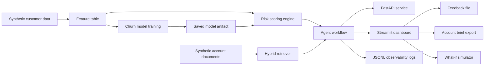
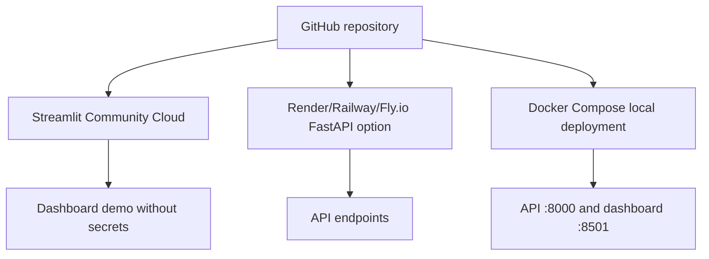

# Architecture

Revenue Risk Intelligence Agent is a synthetic, end-to-end customer-success decision system. It is designed to show how machine learning, retrieval, agent workflow design, evaluation, observability, and dashboarding can work together in a practical business product.

## System Architecture

## Data Flow

1. `scripts/generate_customer_data.py` creates synthetic customer-success account records.
2. `scripts/generate_documents.py` creates synthetic support, contract, onboarding, usage, renewal, and playbook documents.
3. `scripts/train_churn_model.py` trains a scikit-learn churn classifier.
4. `scripts/score_customers.py` scores customers for churn probability and revenue at risk.
5. `scripts/build_retriever.py` builds the local TF-IDF retrieval artifact.
6. `scripts/evaluate_rag.py` evaluates retrieval against a small synthetic question set.
7. FastAPI and Streamlit consume the committed or regenerated artifacts.

## Main Modules

- `src/data`: synthetic customer and document generation
- `src/model`: model training, scoring, and what-if simulation
- `src/rag`: hybrid retrieval interface and TF-IDF fallback
- `src/agent`: LLM provider abstraction, recommendations, account briefs, and grounded response workflow
- `src/api`: FastAPI service
- `src/evaluation`: retrieval and groundedness evaluation
- `src/observability`: JSONL logging and feedback summaries
- `app`: Streamlit dashboard

## ML Pipeline

The ML pipeline uses structured account features to train a churn classifier. The scoring layer converts predictions into decision-support outputs:

- churn probability
- low/medium/high risk band
- revenue at risk
- top risk drivers
- recommended action category

## RAG Pipeline

The retrieval layer uses a `BaseRetriever` interface. The current demo uses a local TF-IDF retriever and a hybrid wrapper that can later combine lexical and semantic scores. Retrieval supports metadata filtering by `customer_id` and `document_type`.

## Agent Workflow

The agent combines:

- customer profile
- churn score
- risk drivers
- retrieved evidence
- user question
- recommendation rules
- optional LLM provider note

It returns a grounded answer, cited evidence, caveats, recommended actions, email draft, and groundedness evaluation.

## Observability And Feedback

Agent runs are logged as JSONL records with run ID, customer ID, question, retrieved document IDs, risk band, latency, response length, and provider mode. Feedback is stored separately with rating and reason so the demo includes a simple human-in-the-loop improvement path.

## Deployment Architecture

## Design Principles

- Synthetic/demo data only.
- Works without paid API keys.
- Business-facing outputs, not model-only outputs.
- Clear separation between data, ML, retrieval, agent, API, dashboard, evaluation, and observability.
- Honest limitations and reproducible setup.

