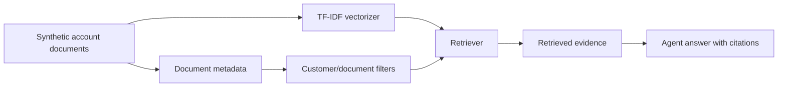

# RAG Evaluation

All retrieval data is synthetic demo data. The current implementation uses a hybrid retrieval interface with local TF-IDF fallback, so the project works without an API key.

## RAG Pipeline



## Evaluation Dataset

The evaluation dataset is:

`data/evaluation/rag_eval_questions.csv`

Fields:

- question ID
- customer ID
- question
- expected risk theme
- expected document type
- expected answer points

## Metrics

- `precision_at_k`: share of retrieved documents matching the expected risk theme.
- `recall_at_k`: whether at least one expected-theme document was retrieved.
- `expected_theme_match`: whether retrieval found the expected risk theme.
- `expected_document_type_match`: whether retrieval found the expected document type.
- `latency_ms`: retrieval latency for each question.
- `groundedness_heuristic`: overlap between retrieved evidence and expected answer points.
- `evidence_coverage_score`: share of expected answer points found in retrieved evidence.
- `top_document_ids`: sample retrieved documents for inspection.

Run:

```bash
make evaluate
```

## Sample Results

Results are saved to:

`data/processed/rag_evaluation_summary.csv`

The latest evaluation shows strong expected-theme retrieval on the synthetic corpus. Some document-type checks can miss, which is useful because it exposes where future retrieval ranking could improve.

## Groundedness And Hallucination Risk

The agent reduces hallucination risk by:

- citing retrieved document IDs
- grounding risk claims in structured model output and retrieved evidence
- including caveats when evidence is weak
- using deterministic recommendation rules
- reporting a groundedness heuristic

## Limitations

- Synthetic documents are cleaner than real CRM/support notes.
- TF-IDF does not understand deep semantic similarity.
- Evaluation labels are small and synthetic.
- The groundedness evaluator is heuristic, not a substitute for expert review.

## Future Improvements

- Add human-labelled relevance judgments.
- Add embedding retrieval when a provider is configured.
- Track citation coverage per answer.
- Add regression thresholds in CI.
- Add LLM-as-judge evaluation only as an optional layer, never as the only evaluation method.

